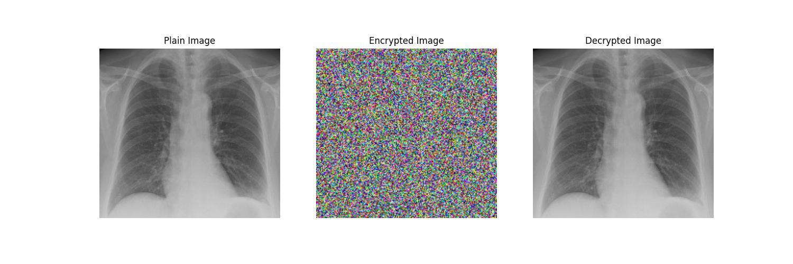
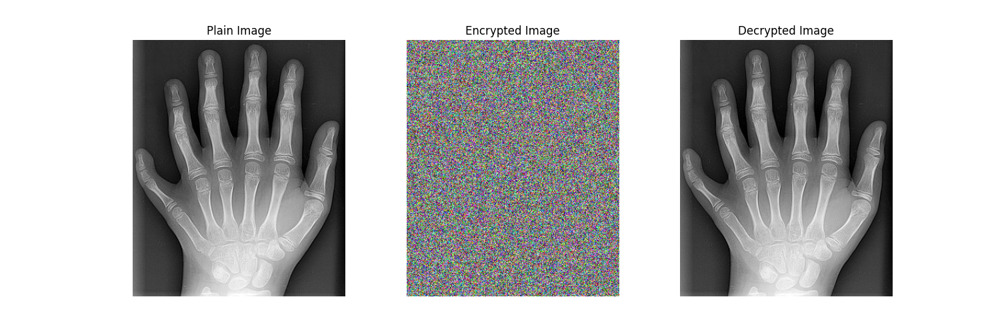
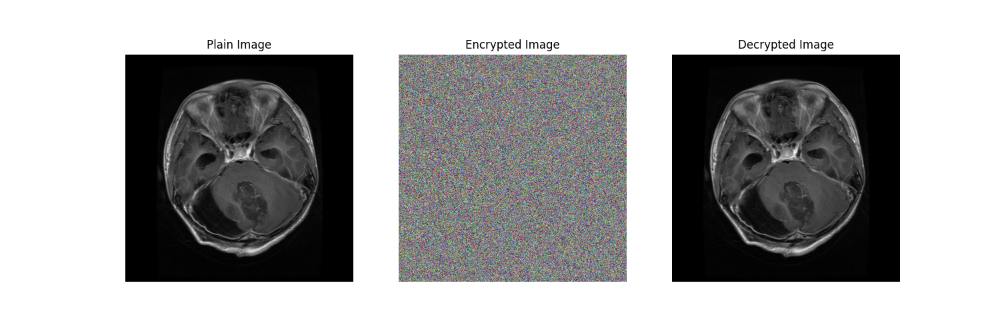
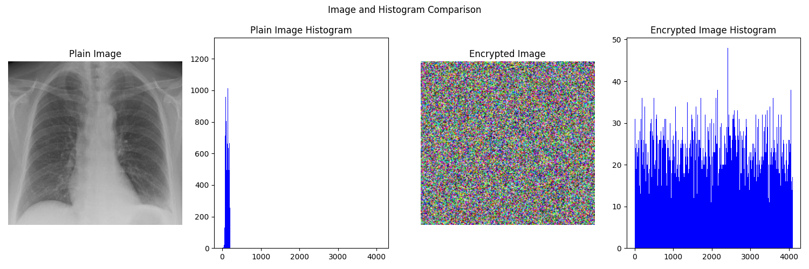
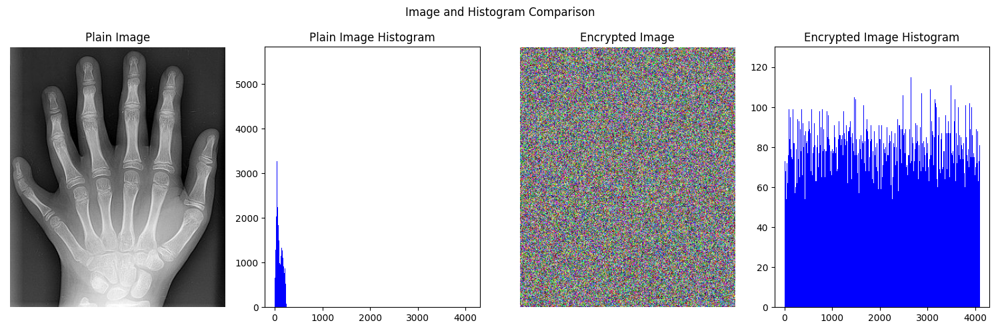
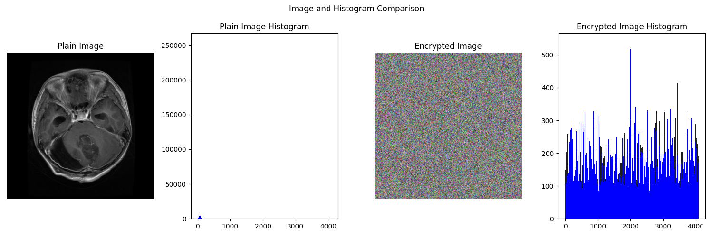

### 2024-NCHU CSE-資訊安全與密碼學 Self-Learning Project
* 組長: 4109064217_黃梓誠
* 組員: 4109064208_方崇瑋、4109064210_游宸睿、4109064233_李文弘

# 醫學圖像加密的研究與應用
> Reference:  [A New 12-Bit Chaotic Image Encryption Scheme Using a 12 × 12 Dynamic S-Box](https://ieeexplore.ieee.org/document/10460526)

## Code 使用方法(Docker)

1. 建立 image：
    `sudo bash init.sh` 或 `sudo docker build -t project .`

2. 執行：
    `sudo bash run.sh` 或 `sudo docker run -it -v $(pwd):/app project`

## Code 使用方法(一般環境)
1. 安裝必要的套件：
    `pip install -r requirements.txt`

2. 執行程式：
    * 執行加解密程式：`python main.py`
    * 執行效能分析程式：`python analysis.py`

## 注意事項
- 請確保已安裝 Python 和 pip。
- 如果使用 Docker 執行的話，請確保已安裝 Docker。

## Encryption and Decryption Result
* 圖1(肺部CT)：

* 圖2(手部CT)：

* 圖3(腦部MRI)：

## Analysis Result
1.	統計分析 (Statistical Analysis)

    |              	| Entropy 	| Horizontal ac. 	| Vertical ac. 	| Diagonal ac. 	|
    |--------------	|---------	|----------------	|--------------	|--------------	|
    | 圖1 (肺部CT)  	| 7.134   	| 0.0026         	| 0.0030       	| -0.0005      	|
    | 圖2 (手部CT)  	| 7.731   	| 0.0009         	| 0.0012       	| 0.0009       	|
    | 圖3 (腦部MRI) 	| 5.222   	| -0.0021        	| 0.0008       	| -0.0011      	|

    **note: ac. means autocorrelation**

2. 密鑰敏感度 (Key Sensitivity)

    |                	| sbox NPCR 	| sbox UACI 	| chaotic map NPCR 	| chaotic map UACI 	|
    |-----------------	|-----------	|-----------	|------------------	|------------------	|
    | 圖1 (肺部CT)     	| 99.983    	| 128.24    	| 99.952           	| 128.14           	|
    | 圖2 (手部CT)     	| 99.969    	| 25.71     	| 99.951           	| 25.48            	|
    | 圖3 (腦部MRI)    	| 99.973    	| 20.58     	| 99.945           	| 21.16            	|

* 圖1(肺部CT)：

* 圖2(手部CT)：

* 圖3(腦部MRI)：

