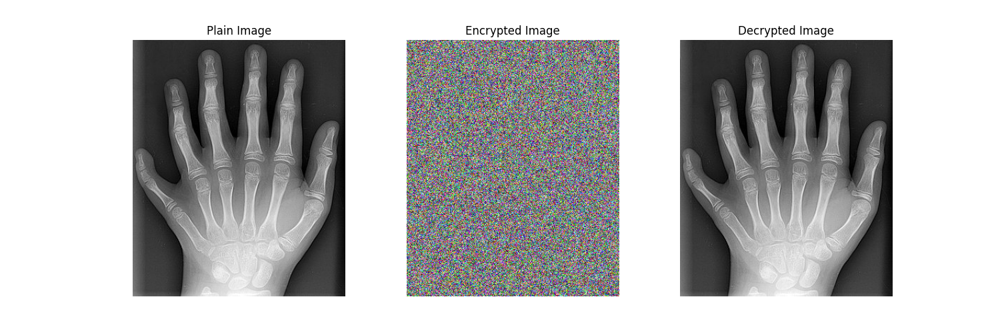
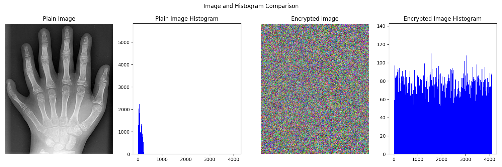

### 2024-NCHU CSE-資訊安全與密碼學 Self-Learning Project
* 組長: 4109064217_黃梓誠
* 組員: 4109064208_方崇瑋、4109064210__游宸睿、4109064233__李文弘

# 醫學圖像加密的研究與應用
> Reference:  [A New 12-Bit Chaotic Image Encryption Scheme Using a 12 × 12 Dynamic S-Box](https://ieeexplore.ieee.org/document/10460526)

## Encryption and Decryption Result

## Analysis Result

## 使用方法(Docker)
1. 建立 image：
    `sudo bash init.sh` 或 `sudo docker build -t project .`

2. 執行：
    `sudo bash run.sh` 或 `sudo docker run -it -v $(pwd):/app project`

## 使用方法(一般環境)
1. 安裝必要的套件：
    `pip install -r requirements.txt`

2. 執行程式：
    * 執行加解密程式：`python main.py`
    * 執行效能分析程式：`python analysis.py`

## 注意事項
- 請確保已安裝 Python 和 pip。
- 如果使用 Docker 執行的話，請確保已安裝 Docker。
